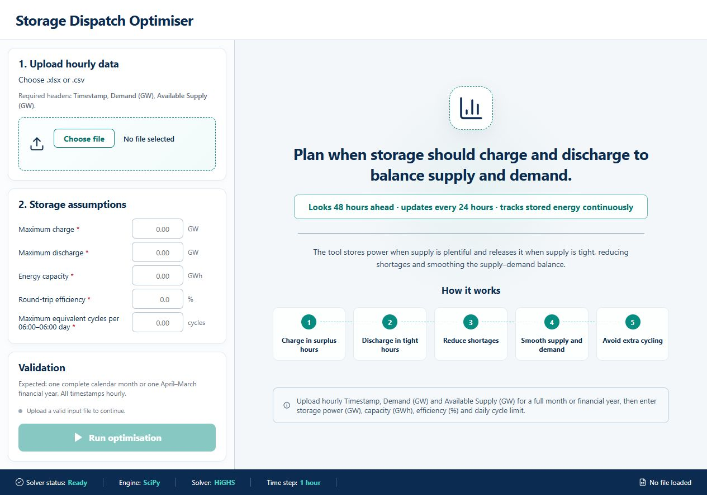
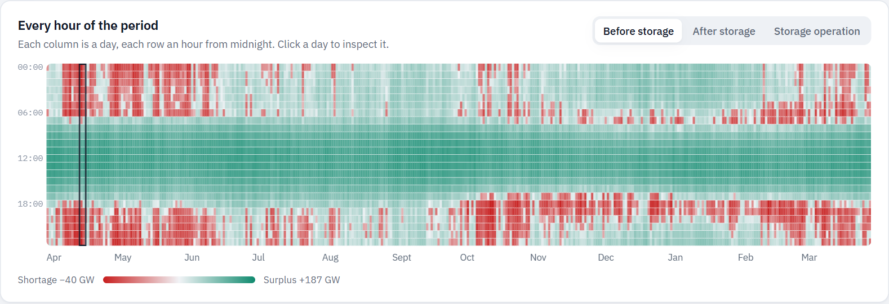
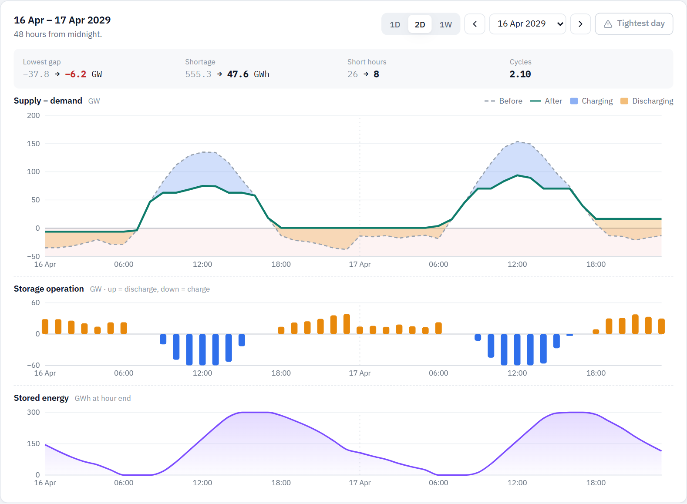

# Storage Adequacy Planner

A local, open-source decision-support tool for exploring how a single combined
storage resource can reshape an hourly supply–demand residual profile.

A 2½-minute tour of the tool, built on the synthetic example year:

https://github.com/user-attachments/assets/7ef1144f-e7b8-4a75-bdd9-fdc0f72540ff

## Download for Windows

No installation or programming needed:

1. Download **[StorageAdequacyPlanner-windows.zip](https://github.com/prashantbhamu/storage-adequacy-planner/releases/latest/download/StorageAdequacyPlanner-windows.zip)** (about 65 MB).
2. Right-click the zip → **Extract All…** → **Extract**.
3. Open the extracted folder and double-click **Storage Adequacy Planner.exe**.
   The planner opens in your browser. Keep the small black window open while
   you use it; close it to stop the planner.

**"Windows protected your PC"?** The app is not yet code-signed, so Windows
warns about it the first time it runs. Click **More info**, then **Run anyway**.

Everything runs on your own computer; uploaded files are not sent anywhere.
Choose **or try the example year** to explore with synthetic data.



## What it does

The tool accepts one complete calendar month or April–March financial year of
hourly demand and available supply. Users set charge power, discharge power,
energy capacity, round-trip efficiency, a daily throughput limit, the initial
and final state of charge (SOC), an optional SOC operating range and whether
charging is limited to surplus hours. Results include before/after headroom,
shortage energy and hours, storage dispatch, SOC, daily cycle use, constraint
checks, a perfect-foresight benchmark, what limits the result, a +10%
sensitivity on each storage limit and a downloadable workbook.

The tool can also size storage: the minimum energy capacity, power, or power
at a fixed duration that holds the residual gap at or above a target in every
hour.

Every hour of the period at a glance — here the example year before storage,
with evening and night deficits in red:



Hourly detail for one day, two days or a week, midnight to midnight: demand and
available supply before and after storage (with charging, discharging and any
remaining shortage shaded), storage operation and stored energy. A toggle
switches the top chart to the supply − demand margin:



This is a **floor-lifting** model, not a merchant revenue optimiser. Its ordered
objectives are:

1. maximise the minimum storage-adjusted residual gap;
2. minimise remaining shortage energy without sacrificing that floor;
3. approach the perfect-foresight SOC at the end of each window (a soft target);
4. progressively level the remaining residual gaps (leximin); and
5. minimise unnecessary throughput.

## Model formulation

- One combined storage lump.
- Linear programming with SciPy's bundled HiGHS solver.
- 48-hour rolling horizon with the first 24 hours committed. Each window's
  soft terminal SOC target follows the SOC trajectory of a whole-period
  perfect-foresight solve, and the result is reported against that optimum.
- Continuous SOC that starts and ends at user-defined levels (% of energy
  capacity) and stays within an optional minimum/maximum operating range.
  A cyclic level (start = end) can be suggested for the entered storage.
- Separate user-defined charge/discharge power limits and energy capacity.
- Symmetric one-way efficiency equal to `sqrt(round-trip efficiency)`.
- No simultaneous charge and discharge.
- By default storage charges only from surplus (supply above demand), so it
  never deepens a shortage; charging in any hour can be allowed instead.
- Maximum internal charging and discharging throughput per 06:00–06:00
  accounting day, prorated for partial days at the study start and end; the
  boundary does not reset SOC.

The optimiser uses demand and available supply only.

## Input format

Upload `.csv` or `.xlsx` with these columns:

| Column | Meaning |
| --- | --- |
| `Timestamp` | Consecutive hourly timestamps |
| `Demand (GW)` | Hourly demand in GW |
| `Available Supply (GW)` | Hourly supply in GW before storage |

The series must cover exactly one calendar month or one April–March financial
year, with no duplicate, missing or irregular hours. Common aliases are detected
automatically; missing or ambiguous columns fail with an explicit message.
Other columns (for example an old Solar column) are ignored.

## API

| Endpoint | Purpose |
| --- | --- |
| `POST /api/validate` | Check the uploaded file and detect the period |
| `POST /api/optimize` | Run the dispatch model; returns hourly results, summary, benchmark, limits and sensitivity |
| `POST /api/suggest-soc` | Suggest a cyclic initial = final SOC for the entered storage |
| `POST /api/size` | Minimum storage for a target floor (`energy`, `power` or `duration` mode) |
| `GET /api/download/{run_id}` | Results workbook |

`settings` (JSON) takes `charge_power_gw`, `discharge_power_gw`, `energy_gwh`,
`rte_percent`, `max_cycles_per_accounting_day`, `initial_soc_percent`,
`final_soc_percent`, and optionally `min_soc_percent` (default 0),
`max_soc_percent` (default 100) and `charge_from_surplus_only` (default true).

Two non-sensitive examples are included:

- `examples/synthetic_fy2029_30.csv` — a full synthetic financial year, loaded by
  "Try with example data" in the app. It keeps only the month × hour average
  shape and the size and persistence of variation of a private FY 2029-30
  planning scenario; every hourly value is generated from a fixed seed, with
  outliers clipped and the level scaled, so no source hour appears in it
  (`examples/generate_synthetic_year.py`, which needs the private workbook).
- `examples/synthetic_april_2031.csv` — a short synthetic month used by the
  regression tests (`python examples/generate_synthetic_input.py`).

## Run locally

Requirements: Python 3.11+ and Node.js 20+.

```bash
python -m venv .venv
# Windows: .venv\Scripts\activate
# macOS/Linux: source .venv/bin/activate
pip install -r requirements.txt

cd frontend
npm install
npm run build
cd ..

python start_tool.py
```

Open `http://127.0.0.1:8765`. On Windows, `start_tool.bat` provides the same
launcher after dependencies and the frontend build are available.

### Build the Windows app

The download is built by the **Windows app** GitHub workflow whenever a
version tag (`v*`) is pushed; it packages the app with PyInstaller, checks it
end to end with the example year and attaches the zip to that release. To
build it by hand after building the frontend:

```bash
pip install pyinstaller
pyinstaller packaging/windows/planner.spec
```

The app appears in `dist/Storage Adequacy Planner/`.

## Tests

```bash
pip install -r requirements-dev.txt
python -m pytest tests -q

cd frontend
npm test
npm run build
```

The public regression suite uses deterministic synthetic data. It pins all 720
hourly charge, discharge, SOC and residual-gap values to six decimal places,
checks objective behaviour and physical constraints, user-defined SOC levels,
surplus-only charging, prorated accounting days, the perfect-foresight
benchmark, sizing minimality, three-column CSV/XLSX uploads and the complete
downloadable workbook. No private or operational dataset is required.

## Scope and limitations

- This is a deterministic planning and scenario-analysis tool, not an operational
  scheduling instruction or market-bidding system.
- It optimises one perfect-foresight scenario at a time; forecast uncertainty,
  reserves, network constraints, unit commitment and degradation cost are out of
  scope.
- Power and energy units are GW and GWh. The tool does not silently convert MW.
- A financial-year run takes roughly 30–40 seconds on a typical laptop,
  including the perfect-foresight benchmark and sensitivity solves.
- Sizing and sensitivity use whole-period perfect foresight; the rolling
  dispatch is checked against it and matched it on the reference datasets.
- Results depend on the supplied data and assumptions and should be reviewed by
  a qualified planner before use in decisions.

## Technology

FastAPI · React · TypeScript · Recharts · NumPy · SciPy/HiGHS · pandas · openpyxl

Licensed under the [MIT License](LICENSE).
